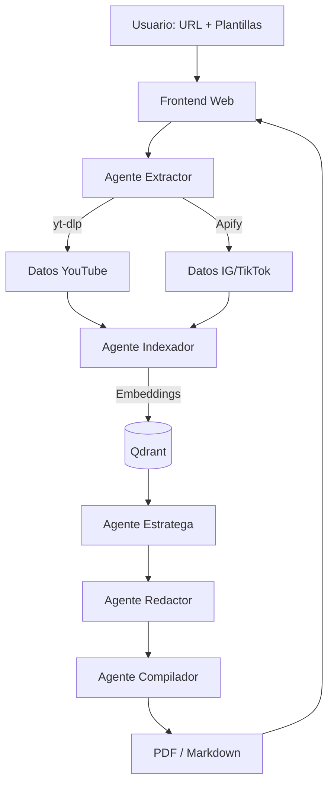

# ContentBrain

Ecosistema de agentes autónomos que automatiza la cadena completa de investigación, planificación y redacción de contenido. Transforma un perfil de referencia en un calendario editorial de alto rendimiento, listo para ejecutar.

## Flujo de Usuario

```
[URL de YouTube/Instagram/TikTok]
         │
         ▼
  ┌──────────────┐
  │  Interfaz Web │  ← Input mínimo: pegar URL + (opcional) plantillas propias
  └──────┬───────┘
         │
         ▼
  ┌──────────────────────┐
  │  Procesamiento Black  │  ← Extracción (yt-dlp, Apify)
  │  Box de Agentes       │  ← Indexación vectorial (Qdrant)
  └──────┬───────────────┘
         │
         ▼
  ┌──────────────────────┐
  │  Generación           │  ← Calendario + guiones + estrategia
  │  Estratégica          │  ← Tres pilares: Viralidad, Autoridad, Venta
  └──────┬───────────────┘
         │
         ▼
  ┌──────────────┐
  │  Descarga     │  ← PDF o Markdown con plan completo del mes
  └──────────────┘
```

## Stack Tecnológico

| Componente | Tecnología | Propósito |
|---|---|---|
| Frontend | Streamlit o React | Interfaz web liviana |
| Orquestación | LangGraph | Ciclos de decisión y persistencia de agentes |
| Memoria vectorial | Qdrant | Inteligencia de nicho a largo plazo |
| Extracción | yt-dlp + Apify | Scraping de contenido de plataformas |
| Modelos LLM | GPT-4o, Gemini 1.5 Pro | Análisis y síntesis creativa |
| Documentos | Generador PDF/Markdown | Compilación del entregable final |

## Arquitectura



Ver [docs/architecture.md](docs/architecture.md) para detalles técnicos y [docs/agents.md](docs/agents.md) para el catálogo de agentes.

## Estructura del Proyecto

```
ContentBrain/
├── README.md
├── docs/
│   ├── architecture.md
│   └── agents.md
├── src/
│   ├── agents/           # Lógica de cada agente
│   │   ├── extractor.py
│   │   ├── indexer.py
│   │   ├── strategist.py
│   │   ├── writer.py
│   │   └── compiler.py
│   ├── graph/            # Orquestación LangGraph
│   │   └── workflow.py
│   ├── services/         # Integraciones externas
│   │   ├── qdrant.py
│   │   ├── ytdlp.py
│   │   └── apify.py
│   └── app.py            # Entry point del frontend
├── templates/            # Plantillas de guiones del usuario
├── output/               # Documentos generados
├── pyproject.toml
├── uv.lock
└── .env.example
```

## Setup

```bash
git clone <repo-url>
cd ContentBrain
uv sync
cp .env.example .env
# Configurar API keys en .env
uv run python src/app.py
```

## Roadmap

- [ ] Documentación y diseño de arquitectura
- [ ] Agente Extractor (yt-dlp + Apify)
- [ ] Integración con Qdrant (indexación vectorial)
- [ ] Orquestación de agentes con LangGraph
- [ ] Agente Estratega (calendario + 3 pilares)
- [ ] Agente Redactor (guiones detallados)
- [ ] Agente Compilador (generación PDF/Markdown)
- [ ] Frontend web (input de URL + descarga)
- [ ] Soporte de plantillas personalizadas del usuario
- [ ] Testing end-to-end y optimización
