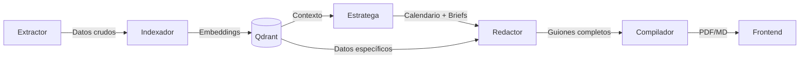

# Catálogo de Agentes

ContentBrain opera con 5 agentes especializados que se ejecutan secuencialmente, orquestados por LangGraph.

## 1. Agente Extractor

**Misión**: Obtener datos crudos de la cuenta de referencia proporcionada por el usuario.

**Herramientas**:
- `yt-dlp` — Descarga transcripciones, metadatos y subtítulos de YouTube
- `Apify` — Scraping de posts, captions y métricas de Instagram y TikTok

**Input**: URL de la cuenta de referencia (YouTube, Instagram o TikTok)

**Output**: Datos estructurados con:
- Títulos y descripciones de los últimos N videos/posts
- Transcripciones completas (YouTube)
- Métricas de engagement (views, likes, comments)
- Hashtags y topics recurrentes
- Hooks de apertura utilizados

**Lógica**:
1. Detecta la plataforma a partir de la URL
2. Selecciona la herramienta de extracción correspondiente
3. Extrae los datos y los normaliza a un formato común
4. Pasa los datos al Agente Indexador

---

## 2. Agente Indexador

**Misión**: Transformar los datos crudos en conocimiento recuperable mediante embeddings vectoriales.

**Herramientas**:
- Modelo de embeddings (OpenAI o sentence-transformers)
- Qdrant como base de datos vectorial

**Input**: Datos estructurados del Agente Extractor

**Output**: Colección en Qdrant indexada y lista para consulta semántica

**Lógica**:
1. Segmenta el contenido en chunks semánticos
2. Genera embeddings para cada chunk
3. Almacena en Qdrant con metadatos (plataforma, fecha, métricas, tipo de contenido)
4. Confirma la indexación exitosa al orquestador

---

## 3. Agente Estratega

**Misión**: Diseñar un calendario editorial mensual balanceado entre los tres pilares estratégicos.

**Herramientas**:
- LLM (GPT-4o) para razonamiento estratégico
- Qdrant para consultar patrones del nicho

**Input**:
- Conocimiento indexado del nicho (vía Qdrant)
- Plantillas del usuario (opcional)

**Output**: Calendario mensual con:
- Fecha y tipo de contenido para cada día de publicación
- Pilar asignado (Viralidad / Autoridad / Venta)
- Brief de cada pieza (tema, ángulo, objetivo)

**Los Tres Pilares**:

| Pilar | Objetivo | Características |
|---|---|---|
| **Viralidad** | Retención masiva y alcance | Hooks potentes, temas trending, formato corto |
| **Autoridad** | Posicionamiento como experto | Datos reales del nicho, contenido educativo profundo |
| **Venta** | Conversión | Copywriting persuasivo, CTAs directos, storytelling de transformación |

**Lógica**:
1. Consulta Qdrant para identificar los temas y formatos con mejor rendimiento
2. Distribuye las publicaciones del mes balanceando los 3 pilares
3. Si el usuario proporcionó plantillas, las usa como estructura base
4. Genera un brief detallado para cada pieza del calendario

---

## 4. Agente Redactor

**Misión**: Escribir los guiones completos para cada pieza del calendario.

**Herramientas**:
- LLM (GPT-4o / Gemini 1.5 Pro) para generación de texto
- Qdrant para inyectar datos específicos del nicho

**Input**: Calendario con briefs del Agente Estratega

**Output**: Guiones completos para cada pieza, incluyendo:
- Hook de apertura (primeros 3-5 segundos)
- Estructura del contenido paso a paso
- Puntos de retención (pattern interrupts)
- CTA de cierre alineado al pilar

**Lógica**:
1. Recibe el brief de cada pieza
2. Consulta Qdrant para obtener datos, ejemplos y vocabulario del nicho
3. Si hay plantilla del usuario, inyecta la información en esa estructura
4. Genera el guión completo respetando el pilar asignado
5. Incluye justificación estratégica de las decisiones creativas

---

## 5. Agente Compilador

**Misión**: Ensamblar todos los guiones y la estrategia en un documento profesional descargable.

**Herramientas**:
- Generador de Markdown
- Generador de PDF (WeasyPrint, ReportLab, o similar)

**Input**: Calendario + guiones + justificaciones del Agente Redactor

**Output**: Documento final en PDF y/o Markdown

**Estructura del documento**:
1. Portada con resumen ejecutivo
2. Calendario mensual visual
3. Guiones detallados organizados por semana
4. Justificación estratégica por pieza
5. Apéndice con datos de referencia del nicho

**Lógica**:
1. Recibe todos los guiones finalizados
2. Organiza el contenido en secciones
3. Aplica formato profesional
4. Genera el archivo en el formato solicitado (PDF/Markdown)
5. Entrega al frontend para descarga

---

## Flujo entre Agentes

