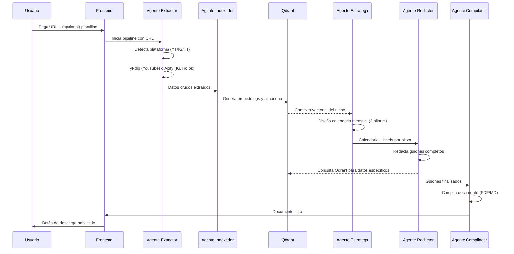

# Arquitectura Técnica

## Diagrama de Flujo de Datos



## Componentes del Sistema

### Frontend Web
- **Tecnología**: Streamlit o React
- **Responsabilidad**: Recibir la URL del usuario, mostrar progreso del procesamiento y habilitar la descarga del documento final
- **Inputs**: URL de YouTube/Instagram/TikTok, plantillas opcionales del usuario
- **Outputs**: Documento descargable (PDF o Markdown)

### Orquestación (LangGraph)
- **Responsabilidad**: Coordinar la ejecución secuencial y condicional de los agentes
- **Gestiona**: Estado compartido entre agentes, reintentos, manejo de errores
- **Persistencia**: Mantiene el estado del pipeline para recuperación ante fallos

### Base de Datos Vectorial (Qdrant)
- **Responsabilidad**: Almacenar y recuperar conocimiento del nicho mediante búsqueda semántica
- **Datos almacenados**: Transcripciones, títulos, descripciones, métricas de engagement, hooks exitosos
- **Beneficio**: Evita respuestas genéricas de la IA — el contenido generado es específico al nicho analizado

### Integraciones Externas

| Servicio | Uso | Datos Extraídos |
|---|---|---|
| **yt-dlp** | Extracción de YouTube | Transcripciones, metadatos, títulos, descripciones |
| **Apify** | Scraping de Instagram/TikTok | Posts, captions, métricas de engagement, hashtags |
| **GPT-4o** | Análisis y generación de texto | Estrategia, redacción de guiones, copywriting |
| **Gemini 1.5 Pro** | Análisis de contenido largo | Procesamiento de transcripciones extensas |

## Formato del Entregable

El documento final incluye:

1. **Calendario Mensual**: Vista de 30 días con el tipo de contenido asignado a cada fecha
2. **Guiones Detallados**: Para cada pieza de contenido:
   - Hook de apertura
   - Estructura del contenido (intro, desarrollo, cierre)
   - CTA específico según el pilar (viralidad/autoridad/venta)
3. **Justificación Estratégica**: Por qué cada pieza fue asignada a ese pilar y cómo contribuye a los objetivos
4. **Datos de Referencia**: Insights del nicho extraídos del análisis que respaldan las decisiones

Formatos de salida soportados:
- **Markdown**: Para edición y reutilización
- **PDF**: Para presentación y entrega profesional

## Variables de Entorno Requeridas

```
OPENAI_API_KEY=         # Para GPT-4o
GOOGLE_API_KEY=         # Para Gemini 1.5 Pro
QDRANT_URL=             # URL de la instancia de Qdrant
QDRANT_API_KEY=         # API key de Qdrant
APIFY_API_TOKEN=        # Para scraping de IG/TikTok
```
